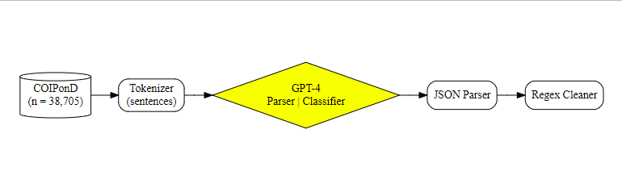

# COI Disclosure Parsing Code

## Description
The code provided here was designed to parse and classify COI statements collected in the “Conflicts of Interest PublicatiON Disclosures” or “COIPonD” dataset. The dataset is available at [https://doi.org/10.18738/T8/GBSTTH](https://doi.org/10.18738/T8/GBSTTH). 

## Pipeline 

## Dependencies

* R 4.4.1
* tidyverse 2.0.0 
* jsonlite 1.8.8
* python 3.11.6
* OpenAI gpt-4-0125-preview model (via python openai API) 

## Directory details 

* **gpt_coi_cleaner.py:** Code to submit individual sentences from COI statements to GPT-4 for parsing and return as JSON. 
* **gpt_json_parser_cleaner.R:** Script to extract tabular data from JSONs and clean COI types. 

## Authors

Contributors names and contact info

* S. Scott Graham [sscottgraham.com](https://sscottgraham.com)
* Zoltan P. Majdik [NDSU Researcher Profile](https://www.ndsu.edu/communication/faculty/zoltan_p_majdik/)
* Nandini Sharma [nandsh.com](https://nandsh.com)

## License

This project is licensed under the [Attribution 2.0 Generic (CC BY 2.0)](https://creativecommons.org/licenses/by/2.0/) License.

## Acknowledgments

Development of these resources was supported by the National Institute of General Medical Sciences of the National Institutes of Health under Award Number R01GM141476. PIs: S. Scott Graham, Joshua B. Barbour, Zoltan P. Majdik, and Justin F. Rousseau.

